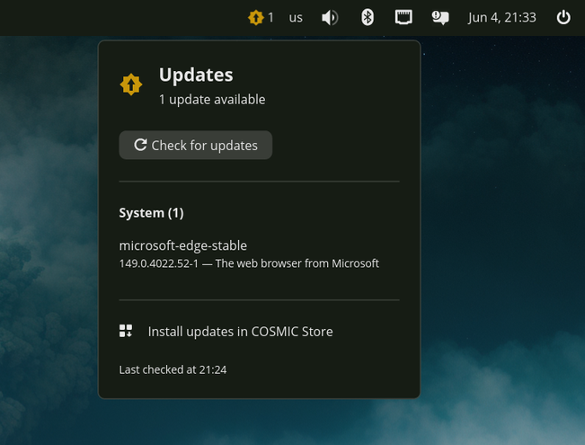
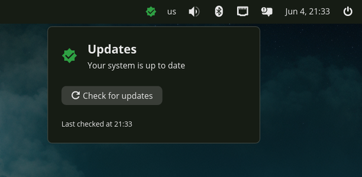

# COSMIC Updates Applet

A panel applet for the **COSMIC** desktop (Pop!_OS) that shows how many app and
system updates are pending and lets you check for new ones with a button. It can
be added to the COSMIC panel or dock like any built-in applet.

## Screenshots

| Updates available | Up to date |
|:---:|:---:|
|  |  |

## What it does

- **Panel button** shows a badge with the total number of pending updates, or a
  ✓ icon when everything is up to date.
- **Popup** (click the button) lists the pending updates, split into:
  - **System** packages — queried via **PackageKit** over D-Bus, the same
    backend the COSMIC Store uses (apt on Pop!_OS).
  - **Flatpak** apps — queried via the `flatpak` CLI.
- **"Check for updates"** button refreshes the package metadata and re-scans.
  - Flatpak always queries its remotes live.
  - System refresh goes through PackageKit; if your polkit policy requires it,
    the desktop's authentication agent will prompt. Per-repo warnings (e.g. a
    missing GPG key) are logged, not shown, so they don't hide real updates.
- **"Install updates in COSMIC Store"** opens `cosmic-store` to apply them.

On startup the applet reads the *cached* update state (no prompt) so the badge
populates immediately.

## Install

One command — no checkout required:

```sh
curl -fsSL https://raw.githubusercontent.com/davidboulay/CosmicUpdate/main/install.sh | bash
```

The installer downloads a **prebuilt binary** from the latest [release](https://github.com/davidboulay/CosmicUpdate/releases)
(x86_64, no Rust needed). On other architectures, or if no release is
available, it automatically **builds from source** instead (requires a Rust
toolchain — edition 2024 / Rust ≥ 1.85).

It installs to `~/.local`:

- binary → `~/.local/bin/cosmic-applet-updates`
- desktop entry → `~/.local/share/applications/com.github.davidboulay.CosmicAppletUpdates.desktop`

Install system-wide with `PREFIX=/usr/local sudo -E bash install.sh`, or from a
checkout with `./install.sh`.

### Add it to the panel

**Settings → Desktop → Panel** (or **Dock**) **→ Add Applet → Updates**.

If it doesn't show up right away, restart the panel:

```sh
cosmic-panel --replace &
```

…or log out and back in.

## Verify the backend without the GUI

```sh
cargo run --example check            # read cached state (no prompt)
cargo run --example check -- refresh # refresh metadata first
```

## Project layout

| File | Purpose |
|------|---------|
| `src/main.rs` | binary entry point |
| `src/lib.rs` | `run()` — launches the applet |
| `src/window.rs` | the applet UI (panel button + popup) |
| `src/backend.rs` | update discovery (PackageKit + flatpak) |
| `examples/check.rs` | headless backend smoke test |
| `data/*.desktop` | COSMIC applet registration |

## Notes

- `libcosmic` is pinned to the revision matching the COSMIC release shipped with
  Pop!_OS 24.04 LTS. Bump the `rev` in `Cargo.toml` if you track a newer COSMIC.
- The app ID is `com.github.davidboulay.CosmicAppletUpdates`; the desktop file
  name must match it.
